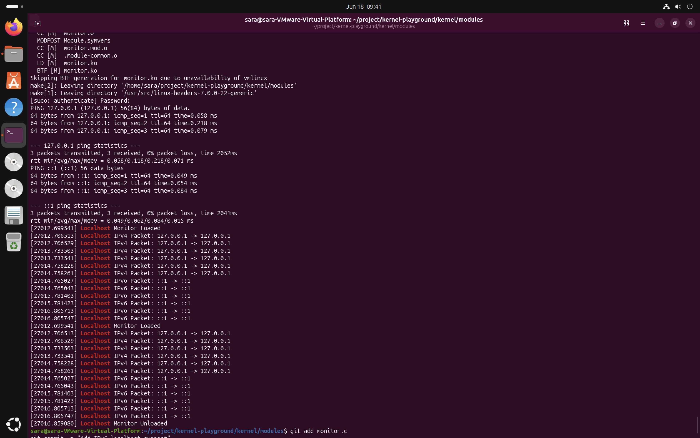

# M5 – Localhost Traffic Monitor

## Overview

This project implements a Linux kernel module that monitors localhost network traffic using the Linux Netfilter framework.

The module detects both IPv4 (`127.0.0.1`) and IPv6 (`::1`) localhost packets. When a localhost packet is detected, the source and destination IP addresses are printed to the Linux kernel log using `printk()`.

---

## Requirements

- Linux operating system
- GCC compiler
- GNU Make
- Linux kernel headers

---

## Project Structure

```
modules/
├── monitor.c
├── Makefile
├── README.md
└── images/
    └── results.png
```

---

## Build

Compile the kernel module:

```bash
make
```

---

## Load the Module

Load the module into the Linux kernel:

```bash
sudo insmod monitor.ko
```

---

## Test

Generate IPv4 localhost traffic:

```bash
ping 127.0.0.1 -c 3
```

Generate IPv6 localhost traffic:

```bash
ping6 ::1 -c 3
```

Display the kernel log:

```bash
dmesg | grep Localhost
```

---

## Remove the Module

Unload the module:

```bash
sudo rmmod monitor
```

---

## Implementation

The project is implemented as a Linux kernel module using the Linux Netfilter framework.

Two Netfilter hooks are registered to inspect localhost traffic:

- IPv4 localhost (`127.0.0.1`)
- IPv6 localhost (`::1`)

Whenever a matching packet is detected, the module logs the source and destination IP addresses using `printk()`. The packets are accepted without modification.

The Netfilter hooks are unregistered when the module is removed.

---

## Example Output

```text
Localhost Monitor Loaded
Localhost IPv4 Packet: 127.0.0.1 -> 127.0.0.1
Localhost IPv6 Packet: ::1 -> ::1
Localhost Monitor Unloaded
```

---

## Results

The module was successfully compiled, loaded, tested, and unloaded.

The following functionality was verified:

- Successful module compilation
- Successful module loading
- IPv4 localhost traffic detection (`127.0.0.1`)
- IPv6 localhost traffic detection (`::1`)
- Kernel log generation using `printk()`
- Successful module unloading

The kernel log confirms that the module correctly detects localhost traffic for both IPv4 and IPv6.

---

## Screenshot

The following screenshot shows the successful execution of the project, including module loading, IPv4 and IPv6 localhost traffic detection, kernel log output, and module unloading.



---

## Files

| File | Description |
|------|-------------|
| monitor.c | Linux kernel module implementation |
| Makefile | Build configuration |
| README.md | Project documentation |

---

## License

This project is released under the GNU General Public License (GPL).

---

## Author

**Sara Mehni**

Course: Software Networks

Assignment: M5 – Localhost Traffic Monitor
